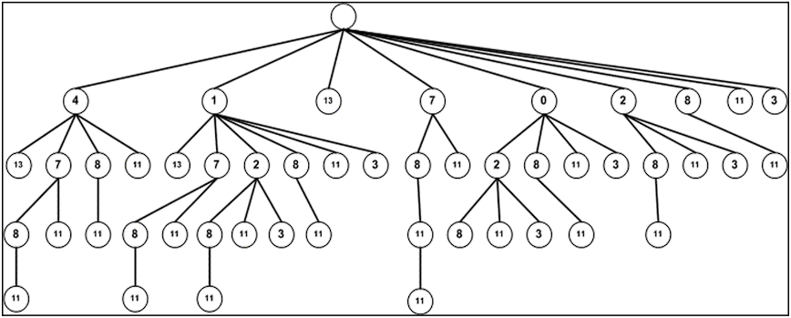
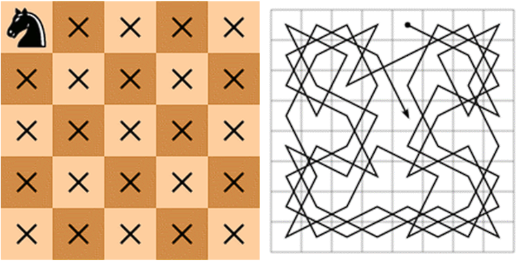

# TGraf_231217_Prak
Praktikum mata kuliah Teori Graf

# Anggota
Kelompok: 13
Nama | NRP
--- | ---
Farhan Dwi Putra | 5025211093
Radhiyan Muhammad Hisan | 5025211166
Darvin Exaudi Simanjuntak | 5025211172

# Praktikum
## 1. Implemantasikan sebuah program untuk menyelesaikan permasalahan “Largest Monotonically Increasing Subsequence”


### Jawab
> Full Kode LMIS :
```c++
#include <iostream>
#include <vector>

using namespace std;

int findLMISLength(const vector<int>& arr) {
    int n = arr.size();
    vector<int> dp(n, 1); // dp[i] stores the length of LMIS ending at index i

    for (int i = 1; i < n; ++i) {
        for (int j = 0; j < i; ++j) {
            if (arr[i] > arr[j] && dp[i] < dp[j] + 1) {
                dp[i] = dp[j] + 1;
            }
        }
    }

    int maxLength = 0;
    for (int i = 0; i < n; ++i) {
        if (dp[i] > maxLength) {
            maxLength = dp[i];
        }
    }

    return maxLength;
}

int main() {
    vector<int> arr = {4, 1, 13, 7, 0, 2, 8, 11, 3};
    
    int result = findLMISLength(arr);

    cout << "Length of Longest Monotonically Increasing Subsequence: " << result << endl;

    return 0;
}
```

### Penjelasan :
Kode di atas adalah implementasi dalam bahasa Python untuk menyelesaikan masalah Largest Monotonically Increasing Subsequence (LMIS).

Largest Monotonically Increasing Subsequence (LMIS) adalah rangkaian elemen terpanjang dalam suatu set bilangan yang diatur sedemikian rupa sehingga setiap elemen lebih besar atau sama dengan elemen sebelumnya. Dengan kata lain, LMIS adalah subsequence yang membentuk urutan yang selalu meningkat dan tidak pernah menurun.

Contoh: Jika kita memiliki rangkaian bilangan [3, 4, 2, 8, 10], maka sebuah LMIS bisa menjadi [3, 4, 8, 10]. Urutan ini memenuhi syarat monotonik meningkat, dan tidak ada subsequence lain yang lebih panjang yang memenuhi kriteria ini dalam rangkaian tersebut.

Dalam implementasi ini, rangkaian bilangan [4, 1, 13, 7, 0, 2, 8, 11, 3] diberikan sebagai contoh input. Logikanya, penyelesaian melibatkan pencarian dan identifikasi Largest Monotonically Increasing Subsequence, yang dalam hal ini adalah [4, 7, 8, 11].

Kode program di atas adalah implementasi dalam C++ untuk mencari panjang dari Longest Monotonically Increasing Subsequence (LMIS) dari suatu array bilangan bulat. Berikut adalah penjelasan singkat untuk setiap bagian dari kode tersebut:

1. `findLMISLength` Function : 
   - Fungsi ini menerima vektor bilangan bulat (`arr`) sebagai parameter dan mengembalikan panjang dari Longest Monotonically Increasing Subsequence.
   - Membuat vektor `dp` dengan ukuran `n` (jumlah elemen dalam `arr`) yang diinisialisasi dengan 1. Vektor ini akan menyimpan panjang dari LMIS yang berakhir di indeks ke-i.
   - Melakukan dua loop bersarang:
     - Loop pertama (`for (int i = 1; i < n; ++i)`) untuk iterasi melalui setiap elemen dalam array, dimulai dari indeks kedua.
     - Loop kedua (`for (int j = 0; j < i; ++j)`) untuk membandingkan elemen-elemen sebelumnya dengan elemen ke-i dan memperbarui panjang LMIS jika ditemukan urutan yang lebih panjang.
   - Setelah kedua loop selesai, mencari nilai maksimum dari vektor `dp` yang akan memberikan panjang dari LMIS terpanjang.

2. `main` Function :
   - Fungsi utama dimulai dengan membuat vektor `arr` sebagai contoh input dengan nilai `{4, 1, 13, 7, 0, 2, 8, 11, 3}`.
   - Memanggil fungsi `findLMISLength` dengan vektor `arr` sebagai argumen dan menyimpan hasilnya dalam variabel `result`.
   - Mencetak hasil panjang LMIS ke layar menggunakan `cout`.

Jadi, secara keseluruhan, program ini menggunakan pendekatan dynamic programming untuk menghitung panjang dari Longest Monotonically Increasing Subsequence dari array yang diberikan dan mencetak hasilnya ke layar.

Dengan hasil implementasi ini, kita dapat menyimpulkan bahwa panjang subsequence terpanjang adalah 4, dan subsequence tersebut terdiri dari angka-angka [4, 7, 8, 11].


## 2. The knight’s tour
Jika sebuah bidak kuda diletakkan pada sebarang kotak untuk kemudian melakukan perjalanan (dengan cara pergerakan kuda) mengunjungi ke semua (8 x 8) kotak papan catur.<br>
Jika diinginkan situasi bahwa kuda tsb dapat:
- Mengakhiri perjalanan pada attacking square (closed tour);
- Mengakhiri perjalanan di sebarang kotak (open tour);

Maka aplikasikan algoritma untuk menyelesaikan masalah di atas ke dalam sebuah program dengan menunjukkan rute perjalanan seperti gambar kanan.<br>


### Jawab

> Open Tour dengan Backtracking
```
# Python3 program to solve Knight Tour problem using Backtracking

# Ukuran Papan Catur
ukuran_papan = 8

def apakah_aman(x, y, papan):
    '''
        Fungsi utilitas untuk memeriksa apakah i,j adalah indeks yang valid
        untuk papan catur berukuran N*N
    '''
    if (x >= 0 and y >= 0 and x < ukuran_papan and y < ukuran_papan and papan[x][y] == -1):
        return True
    return False

def cetak_solusi(ukuran_papan, papan):
    '''
        Fungsi utilitas untuk mencetak matriks Papan Catur
    '''
    for i in range(ukuran_papan):
        for j in range(ukuran_papan):
            print(papan[i][j], end=' ')
        print()

def solve_knight_tour(ukuran_papan):
    '''
        Fungsi ini memecahkan masalah Knight Tour menggunakan
        Backtracking. Fungsi ini utamanya menggunakan solve_knight_tour_util()
        untuk memecahkan masalahnya. Ini mengembalikan False jika tidak ada tour
        yang lengkap mungkin, sebaliknya mengembalikan True dan mencetak tournya.
        Harap dicatat bahwa mungkin ada lebih dari satu solusi,
        fungsi ini mencetak salah satu solusi yang memungkinkan.
    '''

    # Inisialisasi matriks Papan
    papan = [[-1 for i in range(ukuran_papan)] for i in range(ukuran_papan)]

    # move_x dan move_y mendefinisikan langkah berikutnya dari Knight.
    # move_x adalah untuk nilai x koordinat berikutnya
    # move_y adalah untuk nilai y koordinat berikutnya
    move_x = [2, 1, -1, -2, -2, -1, 1, 2]
    move_y = [1, 2, 2, 1, -1, -2, -2, -1]

    # Karena Knight awalnya berada di blok pertama
    papan[0][0] = 0

    # Penghitung langkah untuk posisi knight
    pos = 1

    # Memeriksa apakah solusi ada atau tidak
    if (not solve_knight_tour_util(ukuran_papan, papan, 0, 0, move_x, move_y, pos)):
        print("Solusi tidak ada")
    else:
        cetak_solusi(ukuran_papan, papan)

def solve_knight_tour_util(ukuran_papan, papan, curr_x, curr_y, move_x, move_y, pos):
    '''
        Fungsi utilitas rekursif untuk memecahkan masalah Knight Tour
    '''

    if (pos == ukuran_papan ** 2):
        return True

    # Coba semua langkah berikutnya dari koordinat x, y saat ini
    for i in range(8):
        new_x = curr_x + move_x[i]
        new_y = curr_y + move_y[i]
        if (apakah_aman(new_x, new_y, papan)):
            papan[new_x][new_y] = pos
            if (solve_knight_tour_util(ukuran_papan, papan, new_x, new_y, move_x, move_y, pos + 1)):
                return True

            # Backtracking
            papan[new_x][new_y] = -1
    return False

# Kode Pengendali
if __name__ == "__main__":
    # Panggil Fungsi
    solve_knight_tour(ukuran_papan)
```

### Penjelasan :

1. Fungsi `apakah_aman`
Fungsi ini memeriksa apakah koordinat (x, y) aman untuk dikunjungi oleh knight. Fungsi mengembalikan True jika koordinat aman dan False sebaliknya.

2. Fungsi `solve_knight_tour`
Fungsi utama yang menginisialisasi papan dan memanggil solve_knight_tour_util.

3. Fungsi `solve_knight_tour_util`
Fungsi rekursif yang mencoba semua langkah berikutnya dari posisi knight saat ini.

secara keseluruhan, program ini menggunakan pendekatan backtracking untuk menyelesaikan masalah Tur Knight pada papan catur. Fungsi solve_knight_tour memanggil fungsi utilitas solve_knight_tour_util yang menggunakan rekursi untuk mencoba semua kemungkinan langkah knight hingga menemukan solusi atau menentukan bahwa solusi tidak ada.

### Hasil :


> Closed Tour dengan Warnsdorff's algorithm :
```python
# Python program to for Knight's tour problem using
# Warnsdorff's algorithm
import random

class Cell:
	def __init__(self, x, y):
		self.x = x
		self.y = y

N = 8

# Move pattern on basis of the change of
# x coordinates and y coordinates respectively
cx = [1, 1, 2, 2, -1, -1, -2, -2]
cy = [2, -2, 1, -1, 2, -2, 1, -1]

# function restricts the knight to remain within
# the 8x8 chessboard
def limits(x, y):
	return ((x >= 0 and y >= 0) and (x < N and y < N))

# Checks whether a square is valid and empty or not
def isempty(a, x, y):
	return (limits(x, y)) and (a[y * N + x] < 0)

# Returns the number of empty squares adjacent to (x, y)
def getDegree(a, x, y):
	count = 0
	for i in range(N):
		if isempty(a, (x + cx[i]), (y + cy[i])):
			count += 1
	return count

# Picks next point using Warnsdorff's heuristic.
# Returns false if it is not possible to pick
# next point.
def nextMove(a, cell):
	min_deg_idx = -1
	c = 0
	min_deg = (N + 1)
	nx = 0
	ny = 0

	# Try all N adjacent of (*x, *y) starting
	# from a random adjacent. Find the adjacent
	# with minimum degree.
	start = random.randint(0, 1000) % N
	for count in range(0, N):
		i = (start + count) % N
		nx = cell.x + cx[i]
		ny = cell.y + cy[i]
		c = getDegree(a, nx, ny)
		if ((isempty(a, nx, ny)) and c < min_deg):
			min_deg_idx = i
			min_deg = c

	# IF we could not find a next cell
	if (min_deg_idx == -1):
		return None

	# Store coordinates of next point
	nx = cell.x + cx[min_deg_idx]
	ny = cell.y + cy[min_deg_idx]

	# Mark next move
	a[ny * N + nx] = a[(cell.y) * N + (cell.x)] + 1

	# Update next point
	cell.x = nx
	cell.y = ny

	return cell

# displays the chessboard with all the legal knight's moves
def printA(a):
	for i in range(N):
		for j in range(N):
			print("%d\t" % a[j * N + i], end="")
		print()

# checks its neighbouring squares
# If the knight ends on a square that is one knight's move from the beginning square,then tour is closed
def neighbour(x, y, xx, yy):
	for i in range(N):
		if ((x + cx[i]) == xx) and ((y + cy[i]) == yy):
			return True
	return False

# Generates the legal moves using warnsdorff's heuristics. Returns false if not possible
def findClosedTour():
	# Filling up the chessboard matrix with -1's
	a = [-1] * N * N

	# initial position
	sx = 3
	sy = 2

	# Current points are same as initial points
	cell = Cell(sx, sy)

	a[cell.y * N + cell.x] = 1 # Mark first move.

	# Keep picking next points using Warnsdorff's heuristic
	ret = None
	for i in range(N * N - 1):
		ret = nextMove(a, cell)
		if ret == None:
			return False

	# Check if tour is closed (Can end at starting point)
	if not neighbour(ret.x, ret.y, sx, sy):
		return False
	printA(a)
	return True


# Driver Code
if __name__ == '__main__':
	# While we don't get a solution
	while not findClosedTour():
		pass
```

### Penjelasan :

`Import library dan inisialisasi konstanta`
```python
import random

class Cell:
    def __init__(self, x, y):
        self.x = x
        self.y = y

N = 8

cx = [1, 1, 2, 2, -1, -1, -2, -2]
cy = [2, -2, 1, -1, 2, -2, 1, -1]
```

- Import Library: Kode ini mengimport modul random untuk digunakan dalam pemilihan langkah berikutnya secara acak.
- Class Cell: Digunakan untuk merepresentasikan koordinat sel pada papan catur.
- N: Variabel konstanta yang menyatakan ukuran papan catur (8x8).
- cx dan cy: Menentukan perubahan koordinat x dan y untuk setiap langkah yang mungkin oleh kuda.

`Fungsi-fungsi utilitas`
```python
def limits(x, y):
    return ((x >= 0 and y >= 0) and (x < N and y < N))

def isempty(a, x, y):
    return (limits(x, y)) and (a[y * N + x] < 0)

def getDegree(a, x, y):
    count = 0
    for i in range(N):
        if isempty(a, (x + cx[i]), (y + cy[i])):
            count += 1
    return count
```
- limits(x, y): Memeriksa apakah koordinat (x, y) berada dalam batas papan catur.
- isempty(a, x, y): Memeriksa apakah sel pada koordinat (x, y) kosong (belum dikunjungi).
- getDegree(a, x, y): Menghitung jumlah sel tetangga yang dapat dikunjungi dari koordinat (x, y).

`Fungsi nextMove`
- Memilih langkah selanjutnya menggunakan algoritma Warnsdorff. Mengembalikan objek Cell yang berisi koordinat langkah selanjutnya atau None jika tidak ada langkah yang mungkin.


`Fungsi printA`
- printA(a): Mencetak papan catur dengan status kunjungan setiap sel.

`Fungsi neighbour`
- Memeriksa apakah koordinat (xx, yy) adalah tetangga dari (x, y).

`Fungsi findClosedTour`
- Menjalankan algoritma Knight's Tour menggunakan algoritma Warnsdorff. Mengembalikan True jika tour tertutup (kuda kembali ke titik awal) dan mencetak papan catur, sebaliknya mengembalikan False.

### Testing dengan starting point [0,4]:
Starting point dapat diganti pada bagian sx dan sy (koordinat x dan y) pada fungsi `def findClosedTour():`. Jadi yang starting point awalnya :
```python
	# initial position
	sx = 3
	sy = 2
```

Diubah menjadi :
```python
	# initial position
	sx = 0
	sy = 0
```

**Hasil :**


